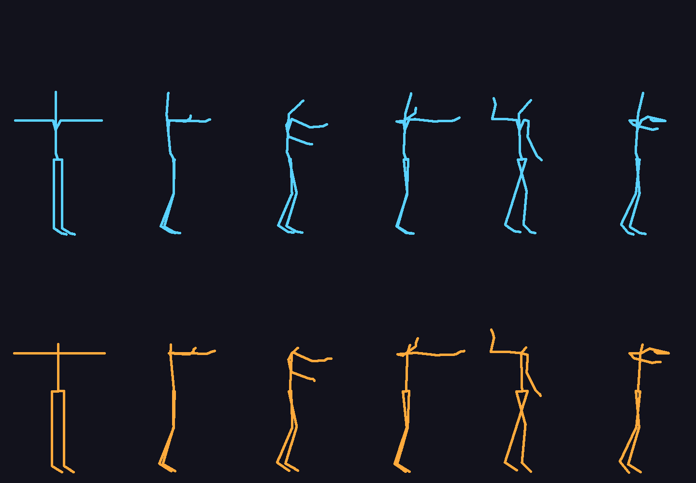

# تحويل FBX إلى IFP لـ MTA:SA

## الملف الناتج

**`clip.ifp`** — حركة واحدة بطول **27.77 ثانية** (834 مفتاح @ 30 إطار/ثانية)،
صيغة **ANP3** (الصيغة الأصلية لـ GTA SA)، 32 مسار عظمة (كل عظام CJ)،
مع حركة الجذر (Root Motion) على العظمة 0.

## كيف تستخدمه في MTA:SA

```lua
-- جانب العميل (client.lua)
local ifp = engineLoadIFP("clip.ifp", "myclip")   -- اسم البلوك اختياري

function playMyAnim()
    if ifp then
        setPedAnimation(localPlayer, "myclip", "clip", -1, true, false, false)
        --                                 ^^^^^ اسم الحركة داخل الملف
    end
end

-- للإيقاف:
-- setPedAnimation(localPlayer, false)
```

> ملاحظة: اسم البلوك ("myclip") يجب ألا يتصادم مع أسماء GTA الداخلية
> مثل `ped` أو `cuts` — استخدم اسماً مخصصاً.

## مطابقة التحويل (نتائج التحقق الآلي)

| الفحص | player.dff | Shrek.dff (نموذج مخصص) |
|---|---|---|
| البنية (ANP3 / 32 عظمة / أوقات متتالية) | ✅ | ✅ |
| دقة الدوران البصري لكل عظمة | **0.10°** أقصى (0.04° متوسط) | 0.10° |
| اتجاهات العظام بـ FK اللعبة نفسها | **0.14°** أقصى | 0.13° |
| الالتفاف (Twist) — المحاور اليمين/اليسار | 0.05° | 0.06° |
| اتجاه الحوض (عرض الوركين) | 0.06° | 0.03° |
| استمرارية حركة الجذر | ✅ (أقصى خطوة 0.026) | ✅ |

ملاحظات:
- `player.dff` نفسه فيه فرق داخلي بين إطار العظمة والـ Skin في إصبع اليد اليسرى
  (2.71°) — هذا من بيانات النموذج الأصلية وليس من التحويل (الـ mesh يتبع الـ Skin).
- العمود الفقري في المصدر 4 عظام وفي CJ عظمتان، فالانحناء داخل هذا الجزء يُجمع
  (حتى 2.6° كمعلومة) — لا يمكن تمثيله بعظام أقل.



## كيف تم التحويل (للمتخصصين)

1. **المرجع**: الهيكل العظمي الحقيقي لـ `player.dff` مع **مصفوفات RpSkin**
   (الارتباط الحقيقي للـ mesh — وليس مجرد إطارات DFF).
2. **مطابقة الوضعية**: الوضعية المرجعية لـ FBX (T-pose) تُطابق على وضعية CJ
   عبر أصغر دوران مطابق لكل عظمة (Min-Rotation) — لذلك الحركة تبدأ بنفس
   وضعية المصدر تماماً.
3. **الحركة**: فروق الدوران العالمية ΔW(t) لكل عظمة تُطبق على CJ، ثم تُحوَّل
   إلى دورانات محلية بنفس اصطلاح اللعبة (الإطارات تستبدل الدوران المحلي كاملاً).
4. **العظام الثابتة** (الفك والحاجبان والصدران والبطن) تستخدم القيم الافتراضية
   الأصلية من `ped.ifp` (مطابقة 100% لسلوك اللعبة).
5. **التوقيت**: مطلق تراكمي بوحدة 1/60 ثانية (كما في GTA SA).

## أداة الويندوز (واجهة Tk)

**التشغيل:** ثبّت Python 3 من python.org (فعّل خيار *Add python.exe to PATH*)،
ثم انقر مرتين على **`FBX2IFP.bat`**.

1. **DFF** ← اختر ملف الشخصية (مثل `player.dff` أو أي ped مخصص) — تتعرف الأداة
   على العظام الـ 32 ومصفوفات الـ Skin تلقائياً (حتى لو كان النموذج مُكبّراً/مُصغّراً).
2. **FBX** ← اختر ملف الحركة (Binary FBX) — تتحقق الأداة من وجود كل العظام المطلوبة.
3. **Convert** ← ينتج ملف `.ifp` جاهز، مع **فحص دقة تلقائي** (PASS/FAIL)
   وكود Lua جاهز للنسخ في تبويب *MTA Lua*.

**ملف exe مستقل (بدون Python):** شغّل `build_exe.bat` مرة واحدة ← `dist\FBX2IFP.exe`.

**سطر الأوامر:** `python tools/fbx2ifp_gui.py --cli player.dff anim.fbx out.ifp clip`

### الهياكل المدعومة (تُكتشف تلقائياً)

| الهيكل | مثال | ملاحظات |
|---|---|---|
| **Mixamo** | `mixamorig:Hips`, `LeftUpLeg`, `LeftHandIndex1` … | الأصابع اختيارية (إن لم توجد تبقى على وضعية الـ DFF) |
| **Newton / Rokoko** | `Root`, `Hips`, `Spine1..4`, `LeftThigh` … | الهيكل الأصلي لهذا المشروع |

- تُقرأ **وضعية الـ T-pose الحقيقية** من الـ FBX (BindPose / Skin clusters)،
  لأن Mixamo يخزّن لقطة من الحركة كوضعية ثابتة (في Samba الوركان مُدارتان 35°).
- ملفات Mixamo القديمة التي فيها bind غير متسق مع الحركة تُكتشف وتُصحَّح تلقائياً.
- إن كان الـ FBX بأسماء أخرى تعرض الأداة قائمة العظام الناقصة بدل إنتاج ملف خاطئ.

### نتائج الاختبار (فحص تلقائي بـ FK اللعبة نفسها)

| FBX | DFF | أقصى خطأ اتجاه | الالتفاف | النتيجة |
|---|---|---|---|---|
| الملف الأصلي (Newton) | player.dff | 0.23° | 0.06° | ✅ PASS |
| Mixamo (three.js) | player.dff | 0.07° | 0.08° | ✅ PASS |
| Mixamo Samba (تصدير قديم) | player.dff | 0.08° | 0.15° | ✅ PASS |
| Mixamo | Shrek.dff | 0.07° | 0.08° | ✅ PASS |
| Mixamo بدون أصابع | player.dff | 0.07° | 0.08° | ✅ PASS |

## الأدوات (داخل المستودع)

- `tools/fbx2ifp.py` — المحوّل الكامل
- `tools/validate_ifp.py` — التحقق الآلي (كل الفحوصات أعلاه)
- `tools/pose_preview.py` — توليد صورة المقارنة `preview.png`
- `tools/fbx2ifp_gui.py` — واجهة Tk (ويندوز) + وضع سطر الأوامر
- `tools/dff_rig.py` — قراءة الهيكل والـ Skin من أي DFF
- `tools/dff_skin.py` — استخراج مصفوفات الـ Skin من player.dff
- `tools/fbx_rig.py` — قارئ FBX (الهيكل + المنحنيات)
- `ref/player_skel.json` / `ref/player_skin.json` — بيانات CJ المرجعية

## إعادة التحويل

```bash
python3 tools/fbx2ifp.py [اسم_الحركة] [المسار_الناتج]
python3 tools/validate_ifp.py clip.ifp
python3 tools/pose_preview.py preview.png
```
